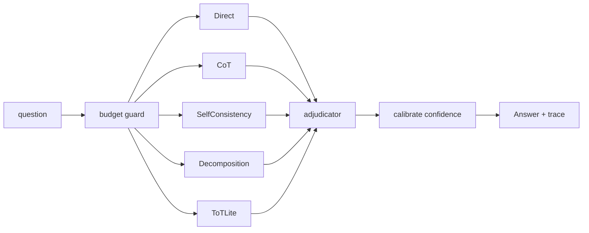

# thinking-loop — spend more inference compute when the question is hard

[](https://github.com/darrshangovender/thinking-loop/actions/workflows/tests.yml)
[](LICENSE)
[](https://python.org)
[](https://anthropic.com)

> Five published test-time reasoning strategies behind one interface, run concurrently against a single question, with a critic LLM adjudicating the candidates and a calibrated confidence attached to the winner. Hard token, time and cost budgets. Full trace. No magic — just the loop, with the strategies as plug-ins.

**Why this exists.** A single call to a single prompt is the entire reasoning surface most applications use, even on hard questions. The 2022–2024 research wave showed that spending more compute at inference time, on the *same* base model, meaningfully lifts accuracy on hard problems. This packages those techniques so switching from "one call" to "five strategies plus adjudication" is a config change rather than a rewrite.

**One of four on inference economics:** [cascade](https://github.com/darrshangovender/cascade) (route to the cheapest model) · `thinking-loop` (spend more when it's hard) · [context-compress](https://github.com/darrshangovender/context-compress) (shrink the input) · [guardrail](https://github.com/darrshangovender/guardrail) (validate both ends). `cascade` and `thinking-loop` pull the same lever in opposite directions — use cascade to route, and thinking-loop as the tier for the hard tail.

---

## Quick start

```bash
pip install -e ".[anthropic,dev]"
export ANTHROPIC_API_KEY=...
python examples/math_demo.py
```

```python
from thinking_loop import ThinkingLoop, Budget
from thinking_loop.strategies import Direct, ChainOfThought, SelfConsistency, Decomposition, ToTLite

loop = ThinkingLoop(
    strategies=[
        Direct(model="claude-haiku-4-5"),
        ChainOfThought(model="claude-sonnet-4-5"),
        SelfConsistency(model="claude-sonnet-4-5", n=5, temperature=0.7),
        Decomposition(model="claude-sonnet-4-5"),
        ToTLite(model="claude-sonnet-4-5", beam_width=3, depth=3),
    ],
    adjudicator_model="claude-opus-4-7",
    budget=Budget(max_tokens=20_000, max_seconds=45, max_cost_usd=0.50),
)

answer = loop.solve("If a train leaves Durban at 14:00 doing 80 km/h ...")
print(answer.final, answer.confidence, answer.winning_strategy)
print(answer.trace.summary())        # strategies · LLM calls · tokens · cost

for c in answer.candidates:
    print(c.strategy, c.answer, c.self_score)
```

## How it works



1. `solve()` resets the budget, opens a fresh trace, and fires every strategy through `asyncio.gather`.
2. Each strategy checks the budget before each model call and emits a trace event after it.
3. A strategy that trips the budget, or raises, records the event and yields `None` — the others carry on.
4. Surviving candidates with a non-empty answer go to the adjudicator.
5. The adjudicator sees all candidates in one prompt and scores each on a rubric (correctness out of 3, reasoning out of 2, calibration out of 2) at temperature 0.
6. `calibrate()` blends cross-strategy agreement, the winner's rubric score, and the variance across scores into a 0–1 confidence.
7. You get the answer, the winning strategy, every candidate, the adjudication, and the trace.

## The five strategies

| Strategy | Origin | Calls | What it does |
|---|---|---|---|
| `Direct` | baseline | 1 | Single call. The control you need in order to claim any lift. |
| `ChainOfThought` | Wei et al. (2022) | 1 | Forces step-by-step reasoning before the final answer |
| `Decomposition` | Press et al. (2022) | 1 | Breaks the question into sub-questions, answers each, composes |
| `SelfConsistency` | Wang et al. (2022) | N | N parallel CoT samples at temperature 0.7, majority vote on the normalised answer |
| `ToTLite` | Yao et al. (2023) | ~b·d·2+1 | Beam search over partial reasoning traces, one scoring call per proposal |

Plus an **adjudicator** (critic LLM with a fixed rubric), a **confidence calibrator**, a **budget** capping tokens, seconds and dollars, and a **trace** capturing every reasoning trace, model call and adjudicator vote.

## Design decisions

| Decision | Why |
|---|---|
| **Strategies are plug-ins behind one interface** | The interesting question is which technique wins on *your* task. That is only answerable if swapping one costs a list entry. |
| **Concurrent, not sequential** | Five sequential strategies means five times the latency, which kills the technique for anything interactive. Concurrency makes wall clock roughly the slowest strategy, not the sum. |
| **A critic model adjudicates rather than a majority vote** | Majority vote across strategies weights a cheap direct answer the same as a beam search. The critic can read the reasoning, not just the answer. |
| **Confidence is a first-class return value** | The point of spending more compute is to know when to trust the result. An answer without a confidence gives the caller nothing to route on. |
| **A `Direct` baseline ships in the default set** | Without the control in the same run, "reasoning helped" is an assertion. |
| **No reflection or refine step** | Reflection adds 2–3× latency for marginal lift on most tasks. Easy to add as a sixth strategy; deliberately out of the v1 surface. |

## Limitations

- **The budget is advisory, not enforcing — nothing is ever cancelled.** The check happens *before* each model call, so a single call that blows the cap runs to completion and is billed. `asyncio.gather` has no timeout and no task cancellation; an over-budget strategy simply raises on its *next* call. The previous README claimed strategies that exceed are cancelled rather than run to completion. They are not.
- **The `Budget` is shared mutable state across concurrent strategies with no lock.** Token, cost and time fields are incremented from worker threads; the read-modify-write across three fields is not atomic and `check()` can observe a torn state.
- **A new SDK client is constructed on every single model call**, each building a fresh HTTP client and connection pool. ToTLite alone issues around nineteen calls at the default beam width and depth. There is no retry either, despite `tenacity` being a declared dependency that is imported nowhere.
- **Majority-vote normalisation collapses any answer containing a number to that number.** It extracts the *last* number by regex and discards everything else — `"16:39"` becomes `"39"`, `"$5 per item, 3 items"` becomes `"3"`. The same function drives cross-strategy agreement in the confidence calibrator **and** grades the benchmark against gold answers, so it corrupts three things at once. This is the highest-value bug in the repo.
- **Answer extraction is a duplicated `startswith("answer:")` line-scan copy-pasted into four strategies.** If the model omits the prefix, the fallback takes the last line of prose as the answer — which then flows into adjudication and grading as a wrong answer indistinguishable from a reasoning failure.
- **The adjudicator's `winner_index` is used as an unchecked list index**, outside the try block. A critic that returns an out-of-range index raises `IndexError` and kills the whole call rather than falling back.
- **Confidence weights are hardcoded and self-admittedly uncalibrated** — the module docstring says so explicitly. There is no calibration harness, no reliability curve, and no test that confidence correlates with correctness. On adjudicator failure the confidence is the literal constant 0.5.
- **The price table silently returns nothing for unknown models**, and the budget skips a `None` cost — so `max_cost_usd` is unenforceable for any model outside the small hardcoded table, with no warning.
- **The benchmark table has been removed from this README.** It cited per-strategy accuracies, median latencies, costs, a "3.7× cost for +25 points" summary, and a 40-question hand-curated set. `benchmarks/gsm8k_subset.yml` contains **14** questions (its own header comment claims 40), no `results.json` is committed, and `make bench` referred to a Makefile that does not exist. Run `python benchmarks/run.py` with a key to produce your own numbers — and read the normalisation bug above before trusting the accuracy column.
- **The confidence calibrator has no length or log-likelihood signal**, despite the previous README claiming one. It uses agreement, adjudicator score, and score variance only.

## Project layout

```
thinking-loop/
├── thinking_loop/
│   ├── core.py           # ThinkingLoop: gather → adjudicate → calibrate
│   ├── strategies/       # base · direct · cot · decomposition · self_consistency · tot_lite
│   ├── adjudicator.py    # critic LLM + rubric + JSON-validated result
│   ├── confidence.py     # agreement + rubric score + variance → 0..1
│   ├── budget.py         # token / time / cost caps
│   ├── trace.py          # structured events, cost + token rollups
│   └── llm.py            # provider dispatch + price table
├── benchmarks/           # run.py + gsm8k_subset.yml (14 questions)
├── examples/             # math_demo · reasoning_demo
└── tests/                # 16 tests
```

## Tests

```bash
pytest tests/ -q         # 16 tests
```

Honest state: the suite covers answer extraction and vote normalisation in the strategies, the budget's cap arithmetic, the adjudicator's parsing, and the confidence blend. `core.py`, `llm.py`, `trace.py` and every strategy's `run()` are uncovered — which is where the concurrency and cancellation problems above live. CI runs the suite on every push.

## Author

Darrshan Govender · [Agulhas Code](https://agulhascode.co.za) · Durban, South Africa
